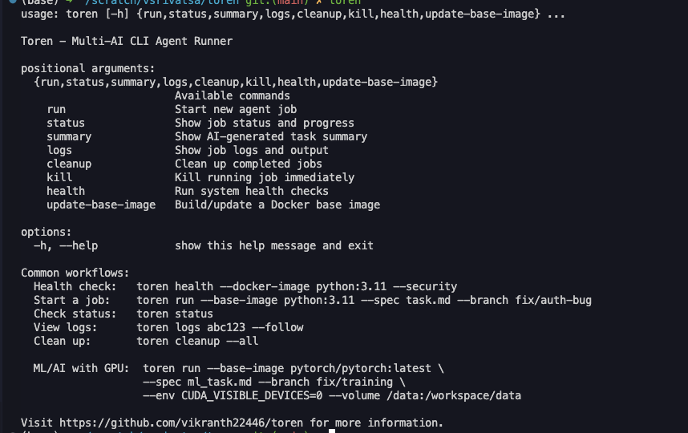
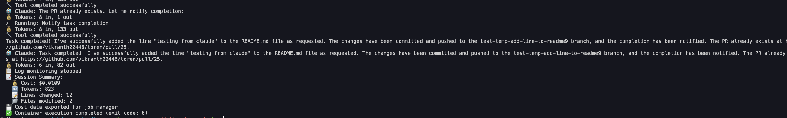
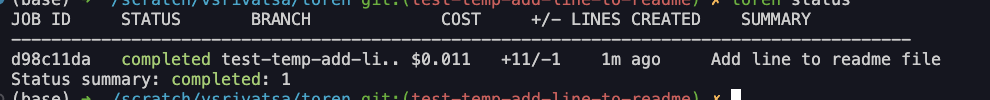
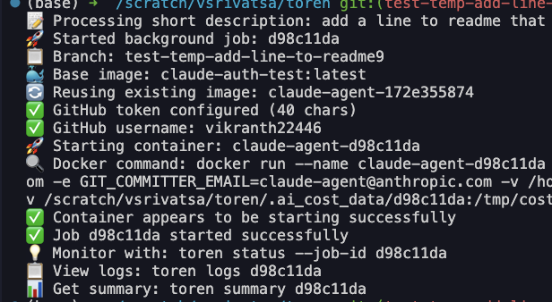
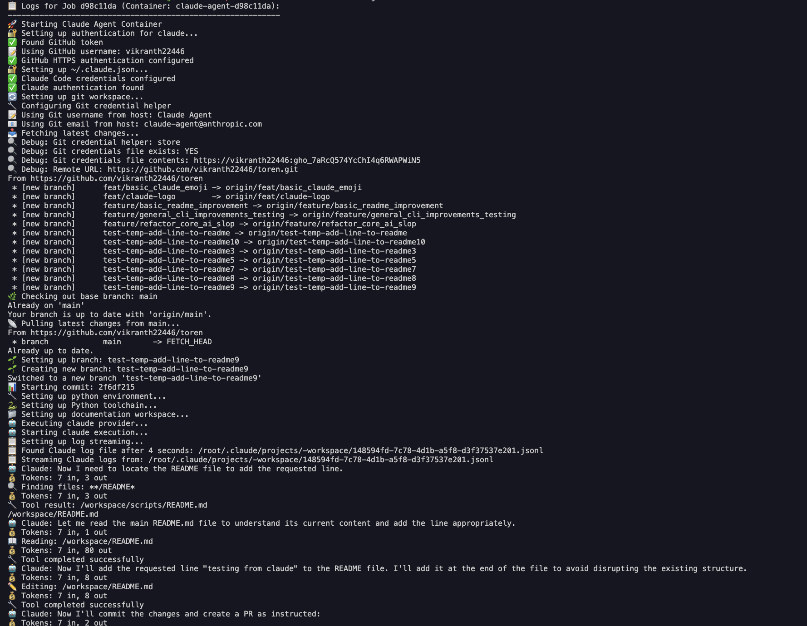

# Toren - Multi-AI CLI Agent Runner

TLDR:
> Modern LLMs are powerful but slow[1]. You cannot test ideas in parallel because both your codebase and your thought process are locked for each run.
> Spinning up extra copies in your local dev is messy and hard to keep in sync.
> Toren provides isolated, ready-to-go environments so you can explore in parallel and move faster.


Toren is an **autonomous containerized agent runner** that simplifies staying in deep work while using AI agents. Most AI coding tools are useful in short bursts, but take you away from deep focus. They need constant checking as *if working with a junior dev*.

Toren is built on the assumption that AI should work as an autonomous agent in our existing local environment.

The hard parts of using AI agents for my use cases:
- Getting them access to the same resources you use — GPUs, model checkpoints, and a proper setup.
- Writing clear, accurate specs so the output is easy to trust and easy to review.
- Setting up many small codebases for them to work

By focusing on writing specifications, you can take ownership and better understand the changes AI will make. 

Using AI agents in async agent environments should be containerized to prevent security issues. Automated security scans should be run since it's hard to fully trust AI generated code.

CLI tools are also becoming *more common*, and Toren makes it easy to **swap tools** or work directly inside your local dev setup. Testing Codex/Claude/etc.

Compared to tools like
- LangChain Open-SWE — Requires using LangChain services and Daytona for development. Also a local cli tool to manage all of it
- Claude Code / Gemini — Pull you out of flow to verify steps and requires opening multiple copies of the codebase for multiple tasks.
- Cursor — Great integration but constantly dictates the next edit, which interrupts your own thinking. For multiple tasks, you need multiple copies of the codebase
- Claude as a GitHub user — Writing full specs in GitHub is cumbersome; providing them directly is simpler. Setting up with local models/checkpoints is also easier with local Docker abstraction. You are also billed on github action minutes. I also want to try differnt CLIs

Most of this code was AI-generated, but I do go through/refactor and fix it. It cost around $100 to make. 


## Features

- **Multi-AI Support**: Works with Claude, Gemini, and extensible to other AI CLIs
- **Docker-based Execution**: Secure, isolated environments with custom base images  
- **Security** some automated security checks
- **Job Management**: Background execution, real-time monitoring, cost tracking
- **GitHub Integration**: Issue processing, PR creation, progress notifications
- **ML/AI**: Can use local resources for quick dev
- 
## Quick Start

### Installation

```bash
pip install -e .
```

### Basic Usage

```bash
# Check help
toren --help
toren run --help

# Run with Claude (default)
toren run --base-image python:3.11 --spec task.md --branch fix/bug

# Run with Gemini
toren run --cli-type gemini --base-image python:3.11 --spec task.md --branch fix/bug

# Process GitHub issue
toren run --issue https://github.com/user/repo/issues/123 --branch fix/issue-123

# Monitor jobs
toren status
toren logs job_id --follow
toren summary job_id

# Health check
toren health --docker-image python:3.11 --security
```

### ML/AI Workflows

```bash
# GPU + model caching
toren run --base-image pytorch/pytorch:latest --spec ml_task.md --branch fix/training \
  --env CUDA_VISIBLE_DEVICES=0 --env HF_HOME=/cache/huggingface \
  --volume /data/models:/workspace/models --volume /cache:/root/.cache
```

## Prerequisites
Install Docker, Your CLI of choice(mainly claude code rn)

For the specific codebase, mount the directory and point to the /workspace section.

```bash
WORKDIR /workspace
COPY . /workspace/
RUN if [ -f requirements.txt ]; then pip install -r requirements; fi
```

Add a config.json if you want a default base image. check config.json.example

## Configuration

## Commands

| Command | Description |
|---------|-------------|
| `toren run` | Start new AI agent job |
| `toren status` | Show job status and progress |
| `toren logs` | Show job logs and output |
| `toren summary` | Show AI-generated task summary |
| `toren cleanup` | Clean up completed jobs |
| `toren kill` | Kill running job immediately |
| `toren health` | Run system health checks |
| `toren review` | Run code review on a PR |

## Key Options

- `--cli-type {claude,gemini,codex}`: Choose AI CLI to use
- `--base-image IMAGE`: Docker base image for execution
- `--spec FILE`: Markdown specification file
- `--issue URL`: GitHub issue to process
- `--branch NAME`: Git branch name to create
- `--env VAR=VALUE`: Environment variables
- `--volume HOST:CONTAINER`: Volume mounts
- `--language {python,rust}`: Project language
- `--cost-estimate`: Estimate AI API costs

# Setting up the local docker image
Mount the current code into a folder with /workspace

## Lint
bash scripts/quality-check.sh. Runs mypy and flake8

# General Screenshots






TODO: make this slightly better as a vid

# Demo Commands

### Toren running on issues/PR
  toren run --base-image python:3.11 --spec task.md --branch fix/auth-bug
  toren run --base-image myproject:dev \
           --issue https://github.com/user/repo/issues/123 \
           --branch fix/issue-123
  toren run --base-image myproject:dev \
           --pr https://github.com/user/repo/issues/123 \
           --branch fix/issue-123

### Toren Health
toren health --docker-image python:3.11 --security

This runs Trivy and the container security scans

### Toren utilities

### Providing a spec and having toren 


# TODO
1. Currently the github token provided has too much access. Reduce it's access scope

[1] I've heard a few anecdotes from friends and the internet about this [pheneomenon](https://x.com/karpathy/status/1954224651443544436?t=3-wpvaSkkjfaoP45-z7iMA).

# File Directory with Emojis 📂

## Core Python Files
- 🚀 **toren.py** - Main orchestration script
- 🤖 **ai_cli_interface.py** - Claude API interface
- 🐳 **container_manager.py** - Docker operations
- 💼 **job_manager.py** - Background job management
- 🛡️ **input_validator.py** - Validation logic
- 🐙 **github_utils.py** - GitHub API integration
- 🎨 **ui_utilities.py** - CLI utilities and dashboard
- 🔧 **cli_parser.py** - Command line parsing
- 📨 **message_templates.py** - Message formatting
- 🔐 **benchmark_security.py** - Security benchmarking
- ⚙️ **setup.py** - Package setup

## Configuration Files
- 🗂️ **config.json** - Main configuration
- 📋 **config.json.example** - Configuration template
- 📝 **requirements.txt** - Python dependencies
- 🔒 **security-requirements.txt** - Security dependencies
- 🏗️ **mypy.ini** - Type checking configuration

## Container Files
- 📦 **Dockerfile** - Container build instructions
- 🎭 **container/entrypoint.sh** - Container orchestration
- 🤖 **container/lib/ai_executor.py** - AI CLI runner
- 🔑 **container/lib/auth_setup.sh** - Authentication setup
- 🏗️ **container/lib/env_setup.sh** - Environment initialization
- 📊 **container/lib/cost_monitor.py** - Cost tracking
- 🌱 **container/lib/git_setup.sh** - Git workspace setup

## Container Configuration
- 🤖 **container/config/ai_providers.json** - AI provider configs
- ⚡ **container/config/defaults.json** - Default settings
- 🌍 **container/config/languages.json** - Language environments

## Documentation
- 📖 **README.md** - Main project documentation
- 📋 **CLAUDE.md** - Claude-specific instructions
- 📥 **INSTALL.md** - Installation guide
- 📚 **scripts/README.md** - Scripts documentation

## Scripts
- 🔍 **scripts/scan_diff.sh** - Git diff security scan
- 🐳 **scripts/scan_containers.sh** - Container vulnerability scan
- 🪝 **scripts/install-hooks.sh** - Pre-commit hook installer
- 📈 **scripts/performance_analysis.sh** - Performance monitoring
- ✅ **scripts/quality-check.sh** - Code quality validation
- 🛡️ **scripts/run_security_scan.sh** - Comprehensive security scan
- 🔒 **scripts/pre-commit-hook** - Pre-commit security hook

## Test Files
- 🧪 **tests/test_ai_cli_interface.py** - AI interface tests
- 🐳 **tests/test_container_manager.py** - Container manager tests
- 🐙 **tests/test_github_utils.py** - GitHub utilities tests
- 🛡️ **tests/test_input_validator.py** - Input validation tests
- 🔗 **tests/test_integration_claude_agent.py** - Integration tests
- 💼 **tests/test_job_manager.py** - Job manager tests
- 🎨 **tests/test_ui_utilities.py** - UI utilities tests

## Other Files
- 🔐 **claude-security-scan** - Security scanning tool
- 🏷️ **toren.egg-info/** - Package metadata directory

# Ack

Thanks to @Tenzen for help 